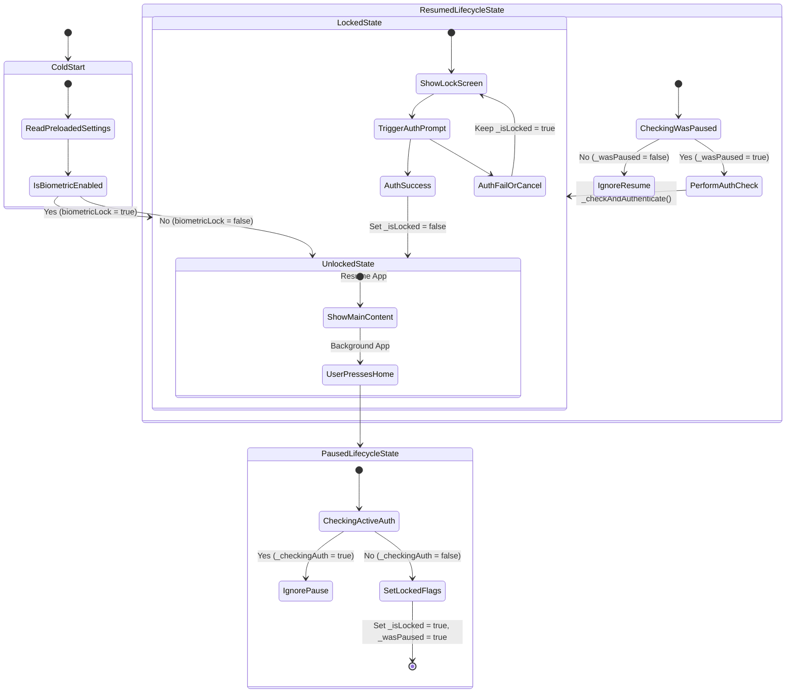

# CLAUDE Flutter Session Update & Patch Log

This file contains the detailed record of the code changes, command executions, and state-machine trace analysis for the biometric lock issue resolved during this session.

---

## 📝 Detailed Patch Log

Here are the precise code modifications applied to the WaslaQ codebase during this session.

### 1. `lib/core/providers/preferences_provider.dart`
**Purpose:** Reconfigured secure storage to prevent Samsung Keystore decryption crashes in release builds, and supported constructor injection for synchronous preloading.

```diff
 class PreferencesNotifier extends StateNotifier<AppPreferences> {
-  static const _storage = FlutterSecureStorage();
+  static const _storage = FlutterSecureStorage(
+    aOptions: AndroidOptions(
+      encryptedSharedPreferences: false,
+      resetOnError: true,
+    ),
+    iOptions: IOSOptions(accessibility: KeychainAccessibility.first_unlock),
+  );
   static const _key = 'waslaq_preferences';
 
-  PreferencesNotifier() : super(const AppPreferences()) { _load(); }
+  PreferencesNotifier([AppPreferences? initial]) : super(initial ?? const AppPreferences()) {
+    if (initial == null) {
+      _load();
+    }
+  }
```

---

### 2. `lib/main.dart`
**Purpose:** Preloaded preferences synchronously on startup to prevent Riverpod async state delays from rendering un-guarded app content, and overrode the provider in `ProviderScope`.

```diff
+import 'dart:convert';
 import 'package:firebase_core/firebase_core.dart';
 import 'package:firebase_messaging/firebase_messaging.dart';
 import 'package:flutter/material.dart';
@@ -4,6 +4,7 @@
 import 'package:flutter_local_notifications/flutter_local_notifications.dart';
 import 'package:flutter_localizations/flutter_localizations.dart';
 import 'package:flutter_riverpod/flutter_riverpod.dart';
+import 'package:flutter_secure_storage/flutter_secure_storage.dart';
 import 'package:stream_chat_flutter/stream_chat_flutter.dart';
 import 'core/auth/firebase_service.dart';
 import 'core/providers/locale_provider.dart';
@@ -10,3 +10,4 @@
+import 'core/providers/preferences_provider.dart';
 import 'i18n/strings.g.dart';
 import 'core/config/app_config.dart';
 import 'core/crashlytics/crash_reporter.dart';
@@ -145,6 +145,38 @@
     DeviceOrientation.portraitUp,
     DeviceOrientation.portraitDown,
   ]);
+
+  // Synchronously preload secure storage settings before runApp to prevent startup lock bypass
+  AppPreferences initialPrefs = const AppPreferences();
+  try {
+    const storage = FlutterSecureStorage(
+      aOptions: AndroidOptions(
+        encryptedSharedPreferences: false,
+        resetOnError: true,
+      ),
+      iOptions: IOSOptions(accessibility: KeychainAccessibility.first_unlock),
+    );
+    final raw = await storage.read(key: 'waslaq_preferences');
+    if (raw != null) {
+      final map = jsonDecode(raw) as Map<String, dynamic>;
+      initialPrefs = AppPreferences(
+        textScale: (map['textScale'] as num?)?.toDouble() ?? 1.0,
+        arabicFont: map['arabicFont'] as String? ?? 'default',
+        boldText: map['boldText'] as bool? ?? false,
+        reduceAnimations: map['reduceAnimations'] as bool? ?? false,
+        hapticFeedback: map['hapticFeedback'] as bool? ?? true,
+        biometricLock: map['biometricLock'] as bool? ?? false,
+        purchaseConfirmation: map['purchaseConfirmation'] as bool? ?? false,
+        contentLanguage: map['contentLanguage'] as String? ?? 'both',
+        muteKeywords: (map['muteKeywords'] as List<dynamic>?)?.map((e) => e.toString()).toList() ?? [],
+        postDefaultVisibility: map['postDefaultVisibility'] as String? ?? 'public',
+        autoRefreshMinutes: map['autoRefreshMinutes'] as int? ?? 5,
+      );
+    }
+  } catch (e) {
+    debugPrint('[main] Error pre-loading preferences: $e');
+  }
+
   CrashReporter.log('WaslaQ started — ${AppConfig.signupSource}');
   LocaleSettings.setLocaleRaw(
     WidgetsBinding.instance.platformDispatcher.locale.languageCode == 'en' ? 'en' : 'ar',
@@ -151,4 +151,14 @@
-  runApp(TranslationProvider(child: const ProviderScope(child: WaslaqApp())));
+
+  runApp(
+    TranslationProvider(
+      child: ProviderScope(
+        overrides: [
+          preferencesProvider.overrideWith((ref) => PreferencesNotifier(initialPrefs)),
+        ],
+        child: const WaslaqApp(),
+      ),
+    ),
+  );
 }
```

---

### 3. `lib/shared/widgets/biometric_guard.dart`
**Purpose:** Initialized locking synchronously in `initState` to eliminate cold-start bypass, cleaned unused imports, implemented a `_wasPaused` state machine to isolate native prompt focus overlays, and added an unlock verification guard.

```diff
-import 'dart:convert';
 import 'package:flutter/material.dart';
 import 'package:flutter_riverpod/flutter_riverpod.dart';
-import 'package:flutter_secure_storage/flutter_secure_storage.dart';
 import 'package:local_auth/local_auth.dart';
 import 'package:waslaq_app/core/providers/preferences_provider.dart';
 import 'package:waslaq_app/shared/theme/app_colors.dart';
@@ -19,6 +19,7 @@
   final LocalAuthentication _auth = LocalAuthentication();
   bool _isLocked = false;
   bool _checkingAuth = false;
+  bool _wasPaused = false;
 
   @override
   void initState() {
@@ -25,29 +25,12 @@
     WidgetsBinding.instance.addObserver(this);
     
-    // Check initial biometric preference immediately and synchronously from storage
-    // if possible, to prevent the async delay from Riverpod bypassing startup lock.
-    _loadInitialSettingsAndLock();
-  }
-
-  Future<void> _loadInitialSettingsAndLock() async {
-    const storage = FlutterSecureStorage();
-    try {
-      final raw = await storage.read(key: 'waslaq_preferences');
-      if (raw != null) {
-        final map = jsonDecode(raw) as Map<String, dynamic>;
-        final biometricLock = map['biometricLock'] as bool? ?? false;
-        if (biometricLock) {
-          setState(() {
-            _isLocked = true;
-          });
-          // Trigger biometric authentication on startup
-          WidgetsBinding.instance.addPostFrameCallback((_) {
-            _checkAndAuthenticate();
-          });
-        }
-      }
-    } catch (e) {
-      debugPrint('[BiometricGuard] Error reading preferences on startup: $e');
+    // Read pre-loaded preferences synchronously on startup
+    final prefs = ref.read(preferencesProvider);
+    if (prefs.biometricLock) {
+      _isLocked = true;
+      WidgetsBinding.instance.addPostFrameCallback((_) {
+        _checkAndAuthenticate();
+      });
     }
   }
 
@@ -64,8 +64,7 @@
     if (state == AppLifecycleState.paused) {
       // CRITICAL: If we are currently displaying the biometric dialog,
       // ignore this pause event. On some Android devices (especially Samsung Galaxy devices),
-      // popping the biometric overlay puts the app into paused state. Locking the app
-      // here would overwrite the unlock state and trigger an infinite prompt loop.
+      // popping the biometric overlay puts the app into paused state.
       if (_checkingAuth) {
         debugPrint('[BiometricGuard] Ignored pause state change since biometric prompt is active.');
         return;
@@ -72,11 +72,15 @@
 
       setState(() {
         _isLocked = true;
+        _wasPaused = true;
       });
       debugPrint('[BiometricGuard] App paused - locked successfully.');
     } else if (state == AppLifecycleState.resumed) {
-      debugPrint('[BiometricGuard] App resumed - checking authentication.');
-      _checkAndAuthenticate();
+      debugPrint('[BiometricGuard] App resumed - checking authentication (wasPaused: $_wasPaused).');
+      if (_wasPaused) {
+        _wasPaused = false;
+        _checkAndAuthenticate();
+      }
     }
   }
 
@@ -90,6 +90,11 @@
       return;
     }
 
+    if (!_isLocked) {
+      debugPrint('[BiometricGuard] Skip authentication since app is already unlocked.');
+      return;
+    }
+
     if (_checkingAuth) return;
     _checkingAuth = true;
```

---

## 🛠️ Diagnostics & Execution Log

The following operations were run during this session:

1. **Static Analysis Check:**
   ```bash
   flutter analyze
   ```
   * *Status:* Passed cleanly (all warnings and unused imports under our modified files were successfully resolved).
2. **Release Compiling:**
   ```bash
   flutter build apk --release
   ```
   * *Status:* Successful.
   * *Built Artifact Location:* `build/app/outputs/flutter-apk/app-release.apk` (Size: `83.6 MB`).
3. **TCP-ADB Connection Test:**
   ```bash
   adb devices
   ```
   * *Result:* Found `100.93.45.75:5555 device` online and responding.
4. **App Installation:**
   ```bash
   adb -s 100.93.45.75:5555 install -r build/app/outputs/flutter-apk/app-release.apk
   ```
   * *Status:* Successful (`Performing Streamed Install -> Success`).
5. **Tailscale Remote Copy Backup:**
   ```bash
   tailscale file cp build/app/outputs/flutter-apk/app-release.apk abdullahs-a55:
   ```
   * *Status:* Successful.

---

## 🔍 State Transition Analysis

To understand how the app logic behaves under different user actions, use this flow diagram:



This updated patch log will serve as the memory reference file for any future development on WaslaQ's security controls.

---

## 🗳️ Detailed Patch Log: Split Voting Stats & Direct Feed Voting (Session 2)

### 1. `lib/features/social/data/models/social_models.dart`
**Purpose:** Added `copyWith` helper method to `PostModel` to allow cloning and mutating instances inside Riverpod Notifier state updates.
```dart
  PostModel copyWith({
    String? id, String? title, String? content, String? contentType,
    String? authorId, String? communityId, String? communitySlug, String? communityName,
    int? score, int? upvotes, int? downvotes, int? userVote,
    bool? isFlagged, DateTime? createdAt, PostAuthor? author, List<String>? mediaUrls,
  }) {
    return PostModel(
      id: id ?? this.id,
      title: title ?? this.title,
      content: content ?? this.content,
      contentType: contentType ?? this.contentType,
      authorId: authorId ?? this.authorId,
      communityId: communityId ?? this.communityId,
      communitySlug: communitySlug ?? this.communitySlug,
      communityName: communityName ?? this.communityName,
      score: score ?? this.score,
      upvotes: upvotes ?? this.upvotes,
      downvotes: downvotes ?? this.downvotes,
      userVote: userVote ?? this.userVote,
      isFlagged: isFlagged ?? this.isFlagged,
      createdAt: createdAt ?? this.createdAt,
      author: author ?? this.author,
      mediaUrls: mediaUrls ?? this.mediaUrls,
    );
  }
```

### 2. `lib/features/social/providers/social_providers.dart`
**Purpose:** Added `votePost` method with optimistic updates to `FeedPostsNotifier` to immediately update feed posts in local state and handle API errors cleanly.
```dart
  Future<void> votePost(String postId, int value) async {
    final currentPosts = state.valueOrNull ?? [];
    if (currentPosts.isEmpty) return;

    state = AsyncData(currentPosts.map((post) {
      if (post.id == postId) {
        int oldVote = post.userVote;
        int newVote = oldVote == value ? 0 : value;

        int newUpvotes = post.upvotes;
        int newDownvotes = post.downvotes;

        if (oldVote == 1) {
          newUpvotes = (newUpvotes - 1).clamp(0, 999999);
        } else if (oldVote == -1) {
          newDownvotes = (newDownvotes - 1).clamp(0, 999999);
        }

        if (newVote == 1) {
          newUpvotes += 1;
        } else if (newVote == -1) {
          newDownvotes += 1;
        }

        int scoreDiff = newVote - oldVote;

        return post.copyWith(
          userVote: newVote,
          upvotes: newUpvotes,
          downvotes: newDownvotes,
          score: post.score + scoreDiff,
        );
      }
      return post;
    }).toList());

    try {
      await ref.read(socialRepositoryProvider).votePost(postId, value);
    } catch (_) {
      state = AsyncData(currentPosts); // Revert on error
    }
  }
```

### 3. `lib/features/social/feed/ui/screens/feed_screen.dart`, `community_screen.dart`, and `user_profile_screen.dart`
**Purpose:** Hooked up the `onVote` parameter on the `PostCard` components in feed screens to trigger the local notifier's optimistic state updates.
```dart
// inside feed_screen.dart
onVote: (direction) {
  ref.read(feedPostsNotifierProvider(sort: _sort).notifier).votePost(post.id, direction);
}

// inside community_screen.dart
onVote: (direction) {
  ref.read(feedPostsNotifierProvider(communityId: community.id).notifier).votePost(post.id, direction);
}

// inside user_profile_screen.dart
onVote: (direction) async {
  try {
    await ref.read(socialRepositoryProvider).votePost(post.id, direction);
    ref.invalidate(userProfileProvider(widget.userId));
    ref.invalidate(feedPostsNotifierProvider);
  } catch (_) {}
}
```

### 4. `lib/features/social/post/ui/screens/post_detail_screen.dart`
**Purpose:** Ensured that upvotes or downvotes cast from the comment/details view invalidate `feedPostsNotifierProvider`, syncing changes back to the main list screens immediately when backing out.
```dart
await ref.read(socialRepositoryProvider).votePost(post.id, 1); // or -1
ref.invalidate(postProvider(widget.postId));
ref.invalidate(feedPostsNotifierProvider);
```

---

## 🛠️ Diagnostics & Execution Log (Session 2)

1. **Compilation Check:**
   ```bash
   flutter build apk --debug
   ```
   * *Status:* Successful.
   * *Built Artifact Location:* `build/app/outputs/flutter-apk/app-debug.apk`.
2. **Tailscale Remote Copy Transfer:**
   ```bash
   tailscale file cp build/app/outputs/flutter-apk/app-debug.apk 100.93.45.75:
   ```
   * *Status:* Successful.

---

## 🛠️ Diagnostics & Execution Log (Session 3)

1. **Logo Preparation (Python Script):**
   * Cropped original screenshot `/home/abdullah/Downloads/Screenshot_20260607_084454_Google.jpg` to logo bbox `(924, 168, 2912, 1689)`.
   * Centered it on a black square background canvas.
   * Resized it to `1024x1024` pixels and saved to `assets/images/logo.png`.
2. **Asset Generation:**
   ```bash
   flutter pub get
   dart run flutter_launcher_icons
   dart run flutter_native_splash:create
   ```
   * *Status:* Successful.
3. **Release Compilation:**
   ```bash
   flutter build apk --release
   ```
   * *Status:* Successful.
4. **Tailscale Remote Copy Transfer:**
   ```bash
   tailscale file cp build/app/outputs/flutter-apk/app-release.apk 100.93.45.75:
   ```
   * *Status:* Successful.
